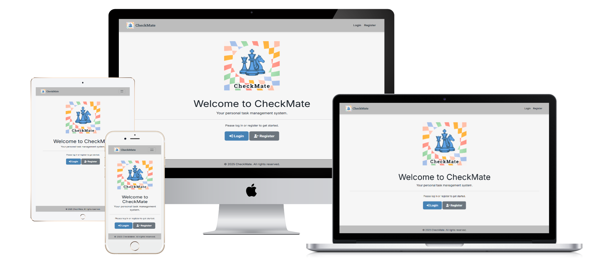

# CheckMate - Milestone Project 3

**A comprehensive web platform providing user-friendly task and project management for individuals and teams, designed to streamline workflows and achieve goals.**

## 1. Overview

Are you struggling to keep track of multiple projects, countless tasks, and critical deadlines? "CheckMate" is a powerful and intuitive Task Management System designed to help individuals and teams organise their work, streamline their workflows, and achieve their goals with strategic clarity. Inspired by the precision and planning of chess, CheckMate empowers users to move their tasks from "To Do" to "Completed" with confidence.

Navigating the complexities of modern workloads, whether personal or professional, often leads to disorganisation, missed deadlines, and a feeling of being overwhelmed. CheckMate is built to cut through this chaos, providing a centralised, straightforward solution for managing all aspects of task and project execution. This intelligent online tool empowers users to effortlessly create, assign, track, and complete tasks within a structured project environment, ensuring nothing falls through the cracks.
platform
Whether you're an individual aiming to master your daily to-do list, a student juggling assignments, or a team collaborating on a complex project, CheckMate offers a user-friendly platform to gain control over your work, fostering efficiency, accountability, and the ultimate satisfaction of a job well done.

## 2. Rationale

CheckMate is an online tool developed to provide a comprehensive and efficient means of managing tasks and projects. Its primary objective is to simplify workflow organisation, enhance productivity, and ensure successful completion of objectives for both individuals and collaborative teams.

The inspiration for CheckMate arose from observing the widespread challenge of effective task management. Many individuals and organisations struggle with scattered notes, forgotten deadlines, and unclear responsibilities, leading to inefficiencies, stress, and unfulfilled potential. This project aims to address these common pain points by offering a structured, intuitive, and readily accessible solution.

In today's fast-paced environment, the ability to effectively plan, execute, and monitor tasks is paramount. Whether it's daily chores, academic assignments, or complex professional endeavours, a robust system is crucial for success. However, existing solutions can often be overly complex, lack specific features, or fail to provide the clear oversight needed to bring tasks to their ultimate "checkmate."

The core problem that CheckMate seeks to resolve is the pervasive inefficiency and disorganisation associated with managing multiple tasks and projects without a centralised, coherent system. This can lead to wasted time, duplicated efforts, missed opportunities, and a general lack of clarity on progress.

CheckMate offers a user-friendly online platform where users can create projects, define tasks within those projects, assign tasks to team members, set priorities and due dates, and track progress through various statuses. The tool will provide intuitive interfaces for task and project creation, modification (CRUD functionality), and dynamic filtering/sorting options to quickly find relevant information. Key features include secure user authentication, distinct project workspaces, and clear visual feedback on task status. This approach provides a strategic and accessible alternative to fragmented planning methods.

CheckMate offers several advantages over current, less integrated methods. It provides significant time-saving through centralised management and streamlined workflows. The structured approach reduces the risk of missed deadlines and forgotten tasks, ensuring greater reliability and accountability. Furthermore, the clear and accessible interface empowers users to better understand their workload and focus on what truly matters. For teams, it facilitates seamless collaboration and provides transparent oversight of collective progress, aiding in adherence to project goals.

The initial scope of CheckMate focuses on providing core task and project management functionalities: user authentication, project creation/management, task CRUD operations (create, read, update, delete), task assignment, due dates, priorities, status tracking, and basic filtering/sorting. Acknowledged limitations include the initial focus on fundamental features before expanding to more advanced collaboration tools or integrations. Potential future enhancements for CheckMate include advanced reporting and analytics, integration with calendars or communication platforms, recurring tasks, sub-tasks, file attachments, and more granular notification settings for deadlines or changes.

In summary, CheckMate addresses a significant need by providing a user-friendly and accurate solution for managing tasks and projects. By simplifying this process, the tool has the potential to save time, reduce errors, improve focus, and ultimately contribute to the more efficient execution and successful completion of individual and collaborative endeavours.
